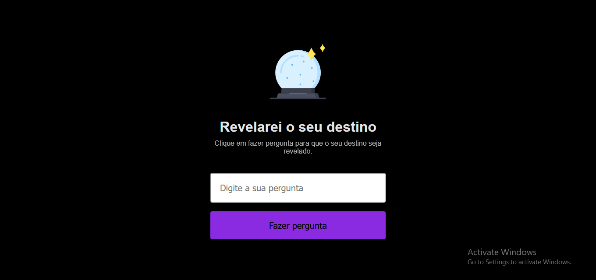
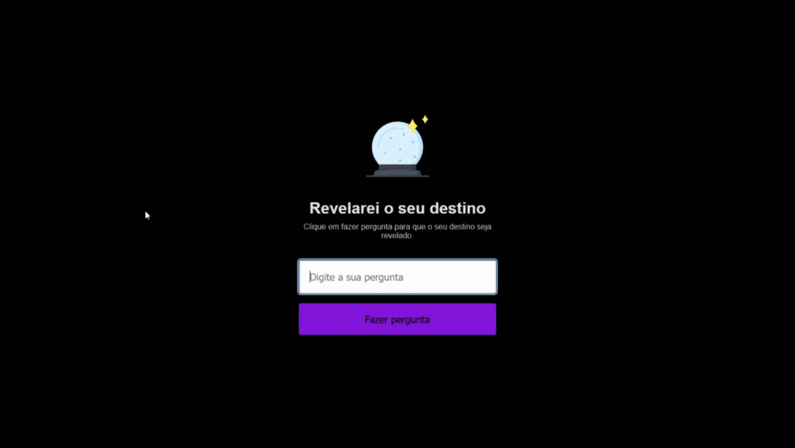

<h1 align = center> Maratona Explorer</h1>

 This was the project that introduced me to Rocketseat and their methodology.

	<a href="#technologies">Technologies</a>&nbsp;&nbsp;&nbsp;|&nbsp;&nbsp;&nbsp;
  <a href="#project">Project</a>&nbsp;&nbsp;&nbsp;|&nbsp;&nbsp;&nbsp;
  <a href="#demonstration">Demonstration</a>&nbsp;&nbsp;&nbsp;

  

 

## Technologies

This project used these technologies:

- HTML;
- CSS;
- JavaScript;
- Git & GitHub.

 

## Project

This is an application that simulates an 8-ball that tells your fortune. 

Features:
- Answers the user's questions.

 

How to use: 
Simply write a yes/no question in the input and click the purple "ask question" button.

 

## Demonstration

 

---

## Thanks for reading!  Diego